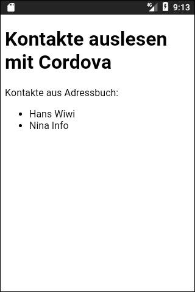

# Cordova-App mit Netzwerk-Info-Plugin #

 

Simple [Cordova](https://cordova.apache.org/) app to demonstrate the usage of 
[this plugin](https://www.npmjs.com/package/cordova-plugin-contacts) to query the address book of the device.
Simply all names (first name and familiy name) of each entry in the address book
are given.

 

 

----

## License ##

 

See the [LICENSE file](LICENSE.md) for license rights and limitations (BSD 3-Clause License)
for the files in this repository except [jQuery](https://jquery.org/license/).

 
